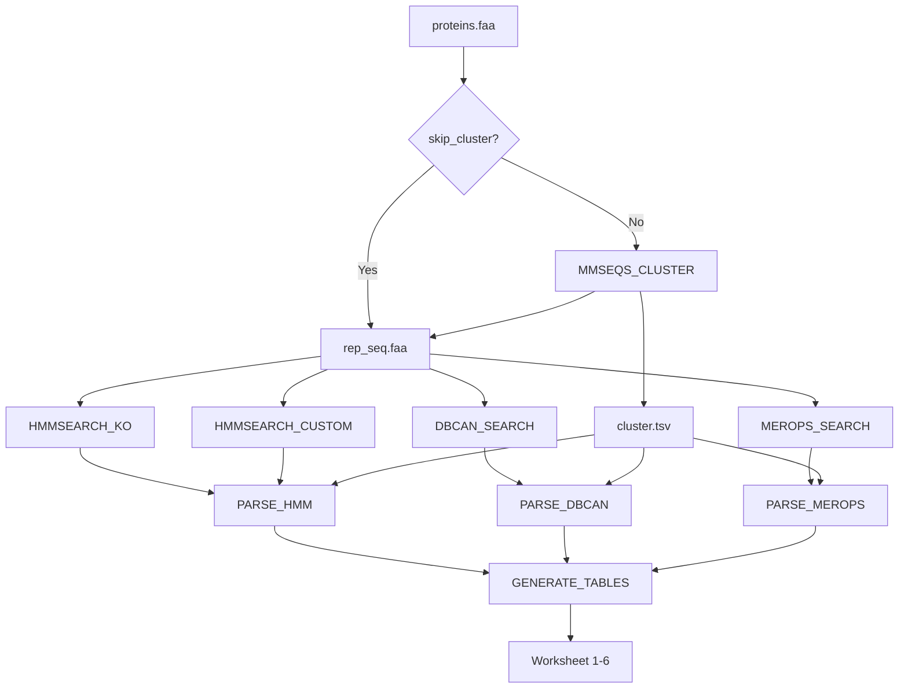

# METABOLIC-Nextflow Implementation

A streamlined, HPC-optimized Nextflow implementation of the **METABOLIC** (Metabolic And Biogeochemistry Analyses In Microbes) pipeline.

## 🚀 Key Features

- **Single Search Architecture**: One `hmmsearch` call for all proteins (vs. N per genome)
- **MMseqs2 Clustering**: Optional protein dereplication reduces search time by 50-80%
- **HPC-Optimized**: Designed for large memory (500GB+) and high CPU (50+) environments
- **Pre-merged HMM Databases**: Eliminates per-HMM I/O overhead
- **Post-Search Thresholding**: Python-based filtering with per-HMM thresholds

---

## 📥 Input Requirements

### Required Files

1. **`proteins.faa`** - Concatenated protein sequences from all genomes/MAGs
2. **`contig_map.tsv`** - Maps contig IDs to genome/MAG IDs

### Protein FASTA Format

> [!IMPORTANT]
> Protein headers **MUST** follow this format: `>contigID_proteinID`

```fasta
>contig001_1 hypothetical protein
MKKLLLLLLLLLLLLLL...
>contig001_2 ATP synthase
MVVVVVVVVVVVVVVVV...
>contig002_1 ribosomal protein
MAAAAAAAAAAAAAAAA...
```

**Naming Convention:**
- `contigID`: The contig identifier (must match `contig_map.tsv`)
- `proteinID`: Integer suffix for protein number on that contig
- Separator: Underscore (`_`) between contigID and proteinID

**If using Prodigal/Pyrodigal:**
```bash
# Prodigal default output already uses this format
prodigal -i genome.fna -a proteins.faa
# Output: >contig001_1, >contig001_2, etc.
```

### Contig Mapping File Format

Tab-separated, no header:
```tsv
contig001	MAG_001
contig002	MAG_001
contig003	MAG_002
scaffold_1	Genome_A
scaffold_2	Genome_A
```

**Column 1**: Contig ID (must match prefix in protein headers)
**Column 2**: Genome/MAG ID

---

## 💻 Usage

### Basic Run (with Clustering)
```bash
nextflow run main.nf \
    --proteins /path/to/all_proteins.faa \
    --contig_map /path/to/contig_to_genome.tsv \
    --outdir ./results \
    -profile singularity
```

### Skip Clustering (Pre-dereplicated Input)
```bash
nextflow run main.nf \
    --proteins /path/to/dereplicated_proteins.faa \
    --contig_map /path/to/contig_to_genome.tsv \
    --skip_cluster \
    -profile singularity
```

### Custom Clustering Parameters
```bash
nextflow run main.nf \
    --proteins /path/to/all_proteins.faa \
    --contig_map /path/to/contig_to_genome.tsv \
    --cluster_sid 0.95 \
    --cluster_cov 0.9 \
    -profile hpc
```

### Parameters

| Parameter | Default | Description |
|-----------|---------|-------------|
| `--proteins` | (required) | Path to concatenated protein FASTA |
| `--contig_map` | (required) | Path to contig-genome mapping TSV |
| `--outdir` | `results` | Output directory |
| `--db_dir` | `$HOME/database/METABOLIC` | Database root directory |
| **Clustering** | | |
| `--skip_cluster` | `false` | Skip MMseqs2 clustering |
| `--cluster_sid` | `0.9` | Minimum sequence identity (90%) |
| `--cluster_cov` | `0.8` | Minimum coverage (80%) |

---

## 💾 Database Setup

### Directory Structure
```
${db_dir}/
├── kofam_database/
│   ├── profiles/           # Original HMMs (optional, for reference)
│   ├── kofam_all.hmm       # Merged KOfam HMMs
│   └── ko_list             # Thresholds from KEGG
├── custom_db/
│   └── metabolic_all.hmm   # Merged custom METABOLIC HMMs
├── METABOLIC_template_and_database/
│   ├── hmm_table_template.txt
│   ├── hmm_table_template_2.txt
│   ├── ko00002.keg
│   ├── kegg_module_step_db.txt
│   ├── motif.txt
│   └── motif.pair.txt
├── dbCAN2/
│   └── dbCAN-fam-HMMs.txt  # Must be indexed with hmmpress
└── MEROPS/
    ├── pepunit.db.dmnd     # Diamond database
    └── pepunit.lib
```

### Merge Commands (One-time Setup)

```bash
DB_DIR="${HOME}/database/METABOLIC"

# 1. Merge KOfam HMMs (~21,000 files)
cat ${DB_DIR}/kofam_database/profiles/*.hmm > ${DB_DIR}/kofam_database/kofam_all.hmm

# 2. Merge Custom METABOLIC HMMs (normalize versions, fix NAME fields)
mkdir -p ${DB_DIR}/custom_db

for f in ${DB_DIR}/METABOLIC_hmm_db/*.hmm; do 
  name=$(basename "$f" .hmm)
  hmmconvert "$f" | sed "s/^NAME  .*/NAME  $name/"
done > ${DB_DIR}/custom_db/metabolic_all.hmm

# 3. Index merged HMMs (required for hmmscan/dbCAN)
hmmpress ${DB_DIR}/custom_db/metabolic_all.hmm
hmmpress ${DB_DIR}/dbCAN2/dbCAN-fam-HMMs.txt
```

---

## 🔬 Pipeline Workflow



### Steps

1. **Cluster** (optional): MMseqs2 clusters proteins by 90% identity (default)
2. **Search**: Representative proteins searched against merged HMM databases
3. **Parse**: Filter hits by thresholds, expand clusters, resolve genome IDs
4. **Generate**: Produce 6 worksheets summarizing metabolic potential

---

## 📊 Output Files

| File | Description |
|------|-------------|
| `METABOLIC_result_worksheet1.tsv` | HMM hit details |
| `METABOLIC_result_worksheet2.tsv` | Function presence/absence matrix |
| `METABOLIC_result_worksheet3.tsv` | KEGG Module completeness |
| `METABOLIC_result_worksheet4.tsv` | Biogeochemical cycle steps |
| `METABOLIC_result_worksheet5.tsv` | dbCAN (CAZyme) hits |
| `METABOLIC_result_worksheet6.tsv` | MEROPS (Peptidase) hits |

---

## ⚙️ Profiles

| Profile | Description |
|---------|-------------|
| `standard` | Local execution |
| `docker` | Docker container |
| `singularity` | Singularity container |
| `hpc` | SLURM cluster (high memory/CPUs) |
| `test` | Test with sample data |
